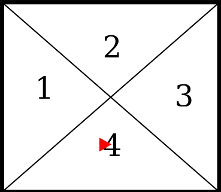

С клавиатуры вводится два числа K и N. Квадратная матрица А(N,N) заполняется случайным образом целыми числами в интервале [-10,10]. Для тестирования использовать не случайное заполнение, а целенаправленное, введенное из файла или полученное генератором. Условно матрица разделена на 4 части:

Формируется матрица F следующим образом: Скопировать в нее матрицу А и если сумма чисел, больших К в нечетных столбцах в области 3 больше, чем произведение чисел по периметру в области 2, то поменять симметрично области 1 и 2 местами, иначе 3 и 4 поменять местами несимметрично. При этом матрица А не меняется. После чего вычисляется выражение: ((К*A)*F+ K\* F T . Выводятся по мере формирования А, F и все матричные операции последовательно.
